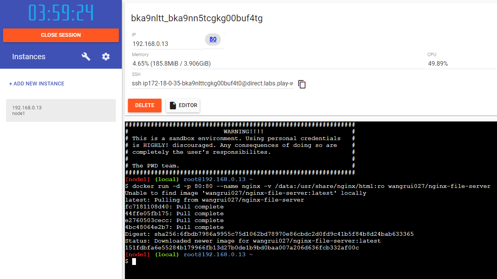
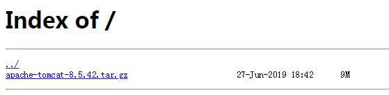

# nginx-file-server文件服务器
## 概述

本镜在nginx:1.16.0的基础上设置时区为上海，并开启文件索引，实现基于nginx最小化配置的文件服务器。

本镜在`nginx:1.16.0`的基础上设置时区为上海，并开启文件索引，实现基于`nginx`最小化配置的文件服务器。

## 测试

建议使用 [https://labs.play-with-docker.com](https://labs.play-with-docker.com)（`PWD`）创建宿主进行镜像测试

1、`docker run`启动容器，启动命令如下：

```bash
# 挂载宿主的/data目录到nginx的html目录
docker run -d -p 80:80 --name nginx -v /data:/usr/share/nginx/html:ro wangrui027/nginx-file-server
```

2、文件服务器启动后PWD页面会弹出映射端口，点击端口超链接访问文件服务器首页。



3、启动容器后进入宿主的`/data`目录，执行`curl`命令下载任意文件。

4、回到文件服务器首页刷新页面，点击下载文件。



## 文末

顺便说一下`PWD`网站可以顺利访问墙外资源，所以理论上利用`PWD`搭一个临时的梯子也不是不可能，一个实例可以使用4个小时哦，完全免费。